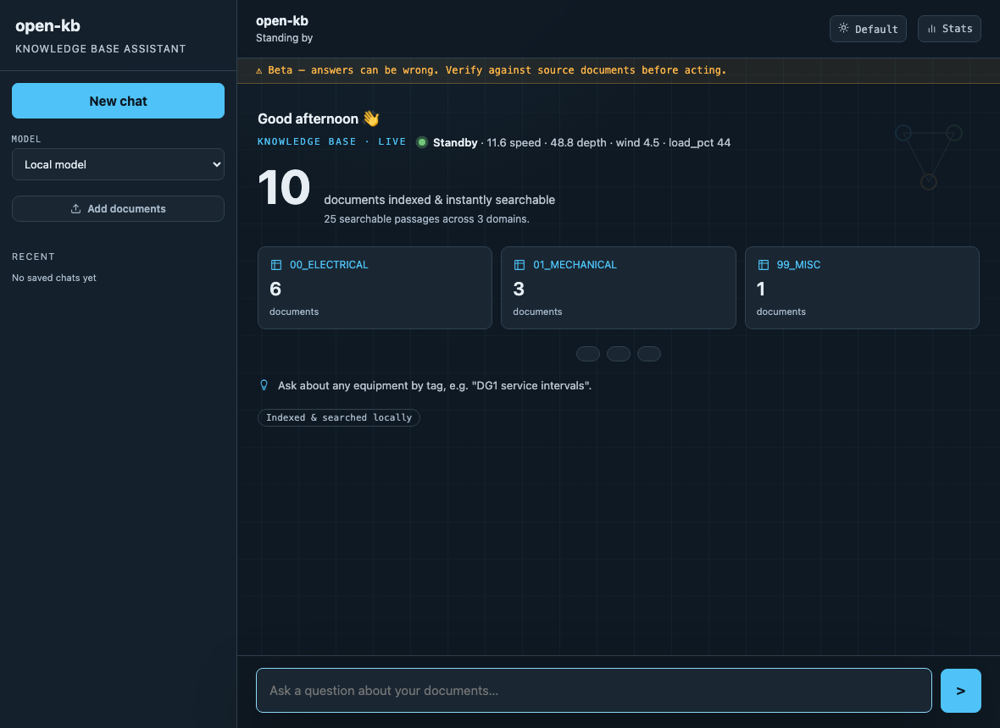
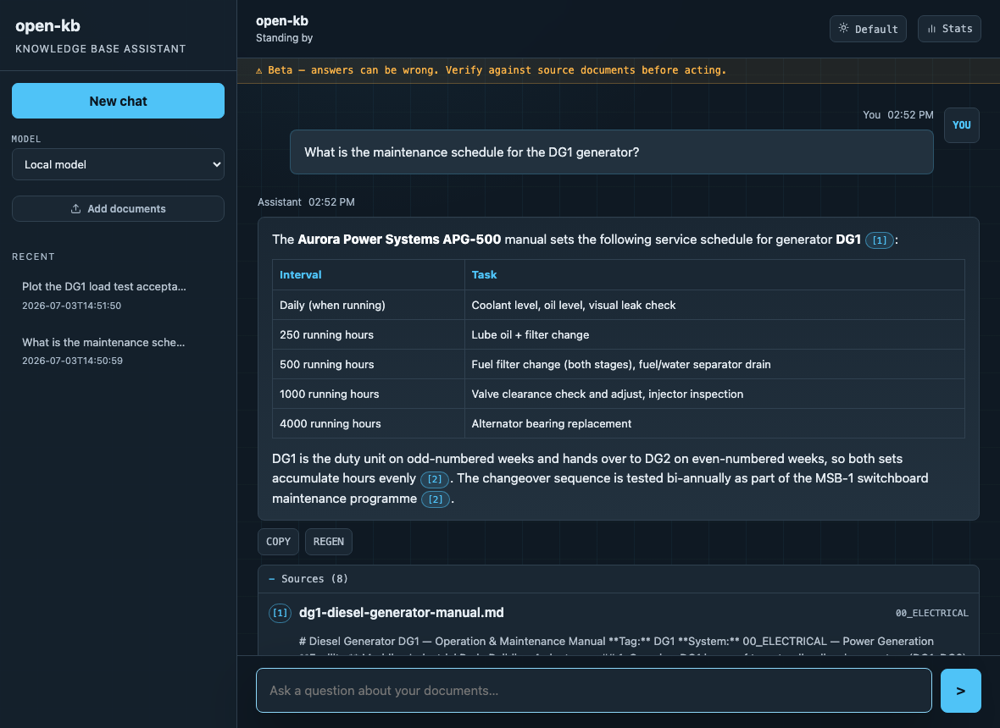
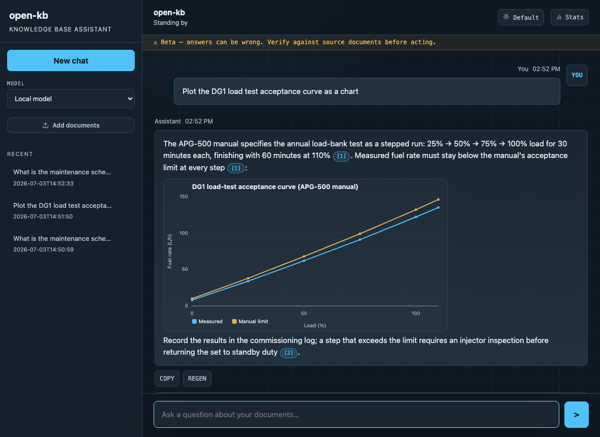
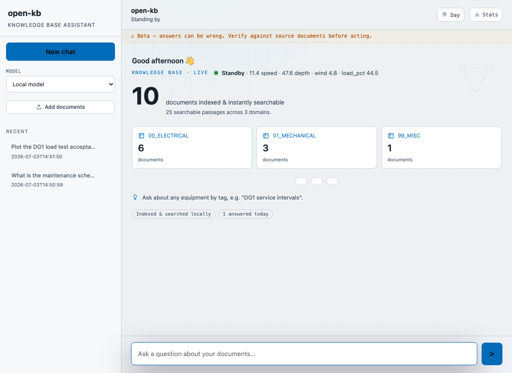

# open-kb-dashboard

**The operator-facing front end for [open-kb](../open-kb)** — a themeable web
dashboard that turns a bare RAG API into something a non-technical operator
would actually want to open every day: a splash screen with live status, a
streaming chat UI with inline citations, and a drag-drop way to teach the
knowledge base new documents.

open-kb itself ships a minimal bundled chat UI (`openkb serve`). This project
is a separate, richer server that sits in front of it — same philosophy
(stdlib only, local-first, config-driven), more surface area: session
history, an engine picker, a live-telemetry pulse, and a design system with
three themes.

> All screenshots below show the **synthetic demo corpus** that ships with the
> open-kb project (invented vendors, fictional facility) and the built-in `demo`
> telemetry provider — no real data anywhere.

**Splash — live pulse, KB stats, domain cards, starter chips** (default theme)



**Chat — streamed markdown answer with citation chips and source cards**



**Inline charts — answers can embed self-contained SVG charts (no JS libraries)**



**Light theme** (three themes ship: default, night, day)



## What it is (and isn't)

- **Is:** a self-contained Python server (`server.py`) that renders a
  dashboard UI and proxies chat/search traffic to an open-kb instance and/or
  an OpenAI-compatible LLM endpoint.
- **Isn't:** a replacement for open-kb. It has no retrieval, no ingest
  pipeline, and no database of its own — it's a client. Point it at a
  running open-kb API and it lights up.

## Feature tour

| Area | What you get |
|---|---|
| **Design system** | Three themes (default / night / day) driven by CSS custom properties, no build step |
| **Splash screen** | Greeting, telemetry pulse (optional), queries-today counter, rotating operating tips, domain cards pulled from the KB, starter question chips |
| **Chat** | Server-sent event delivery with credential-safe buffered answers, full markdown rendering, inline ` ```chart ` blocks rendered as SVG charts |
| **Citations** | Citation chips under every answer; click through to a source viewer modal with the original document text |
| **Sessions** | A sessions rail for past conversations, backed by flat files under `paths.data_dir` |
| **Engine picker** | Switch between any configured backend: `openai` (Ollama, LM Studio, llama.cpp, Groq, or anything speaking `/v1/chat/completions`) or `kb` (answer straight from open-kb's own `/ask`, zero extra LLM calls) |
| **Feedback** | Thumbs up/down with stable turn ID, engine/state and source provenance, logged to `paths.data_dir` |
| **Operational states** | Grounded, partial, KB offline/auth mismatch, model offline, no relevant results and generation failure are shown distinctly |
| **Stats** | `/stats` operator page backed by the uncached `/api/stats` endpoint |
| **Upload** | Drag-and-drop file upload; optionally lands directly in open-kb's ingest inbox (see below) |
| **Credential redaction** | Outbound text is scrubbed of credential-shaped strings before it reaches a browser or LLM (see `redaction.py`) |
| **Live telemetry** | Optional live-data pulse and prompt injection via a pluggable `TelemetryProvider` — see the dedicated section below |

## Architecture

```
        ┌───────────┐        SSE / REST         ┌─────────────────────┐
        │  Browser   │ ─────────────────────────▶ │  dashboard server   │
        │ (static/)  │ ◀───────────────────────── │     (server.py)      │
        └───────────┘                            └──────────┬───────────┘
                                                              │
                            ┌─────────────────────────────────┼─────────────────────────┐
                            ▼                                 ▼                         ▼
                  ┌──────────────────┐            ┌────────────────────┐     ┌───────────────────────┐
                  │   open-kb API     │            │  LLM endpoint(s)    │     │   TelemetryProvider     │
                  │  /health /search   │            │  any OpenAI-compat  │     │  none / demo / custom   │
                  │  /ask (kb engine)  │            │  /v1/chat/completions│     │  (NMEA/SignalK/BMS/...) │
                  └──────────────────┘            └────────────────────┘     └───────────────────────┘
```

The dashboard is a pure client of both open-kb and the LLM endpoint(s) — it
holds no vectors, no chunks, no model weights. Everything it renders is
either proxied from one of those two upstreams or generated locally from
config (themes, tips, starter chips).

## Quickstart

```bash
# 1. clone both projects side by side
git clone <open-kb repo> open-kb
git clone <this repo> open-kb-dashboard

# 2. stand up open-kb first (see open-kb's own quickstart)
cd open-kb
python3 -m venv .venv && source .venv/bin/activate
pip install -e '.[pdf,dev]'
cp config.example.yaml config.yaml
openkb init
openkb serve --port 8080 &

# 3. configure and run the dashboard
cd ../open-kb-dashboard
cp config.example.yaml config.yaml
# edit config.yaml: kb.api_url should point at the open-kb server above
python3 server.py
```

Then open `http://127.0.0.1:8090` in a browser. With no `config.yaml` at
all, the dashboard still starts using its built-in defaults — it just
assumes open-kb is on `127.0.0.1:8080` and a local model is on
`127.0.0.1:11434`.

## Live telemetry — bring your own data

The splash screen can show a small "live pulse" (state, speed, depth, wind,
or whatever fields you like) and, optionally, feed a compact live-data block
into chat answers when a question looks like it needs current readings
(e.g. "what's the current tank level?"). The dashboard has **no built-in
knowledge of any particular telemetry protocol** — it only ever talks to a
`TelemetryProvider`, a two-method Python interface:

```python
class TelemetryProvider(Protocol):
    def snapshot(self) -> dict | None: ...       # splash-screen pulse
    def fetch(self, question: str) -> tuple[str, dict] | None: ...  # chat injection
```

Set `telemetry.provider` in `config.yaml` to one of:

| Value | Behaviour |
|---|---|
| `none` | Telemetry pulse is hidden entirely; chat never gets live-data injection. Zero configuration, zero dependencies. |
| `demo` (default) | Ships with the project. Generates plausible synthetic readings so the UI has something to show out of the box — safe for screenshots, demos, and first-run evaluation. |
| an HTTP-JSON adapter | Point a small provider module at any HTTP endpoint that returns JSON — a common pattern for a BMS/SCADA gateway that already exposes a REST summary. |
| a custom module path | Any importable Python path exposing a `Provider` class implementing the interface above — write your own bridge to NMEA, SignalK, Modbus, a BMS/SCADA historian, or anything else. |

See **[`docs/telemetry-adapter-guide.md`](docs/telemetry-adapter-guide.md)**
for a worked example of each pattern, plus `adapters/telemetry_base.py` for
the full interface contract.

**Privacy default:** `telemetry.sanitise_position: true` (on by default)
strips absolute position fields (lat/long pairs, GPS/fix keys) from every
`fetch()` result before it reaches an LLM prompt or the browser. This
matters for any moving or location-sensitive asset — a vessel, a vehicle
fleet, a mobile plant unit. Only set it `false` if you deliberately want
positions surfaced, e.g. a fixed installation where location isn't
sensitive.

## Security

- **Localhost by default.** `server.host` defaults to `127.0.0.1` — the
  dashboard is not reachable from the network unless you change it or put a
  reverse proxy in front.
- **Optional HTTP Basic auth.** Set `server.auth.user` / `server.auth.password`
  (or the `OPENKB_DASH_SERVER_AUTH__USER` / `__PASSWORD` env vars — never
  commit real values) to require credentials for every route.
- **Reverse-proxy for real exposure.** For anything beyond a single trusted
  machine, put nginx or Caddy in front with TLS and its own auth layer — see
  [`docs/deployment.md`](docs/deployment.md).
- **Credential redaction.** `redaction.py` scrubs credential-shaped strings
  (passwords, API keys, client secrets, bearer tokens, PEM private keys,
  AWS-style access keys) from any text before it's passed on. This is a
  creds-only scrubber, not a general PII/topology redactor — layer your own
  rules on top if you need stricter behaviour.
- **Buffered model output.** Upstream deltas are joined and scrubbed before
  any answer text reaches the browser. This prevents a credential split across
  token boundaries from bypassing the scrubber.

## Documentation map

| Doc | What it covers |
|---|---|
| [`docs/configuration.md`](docs/configuration.md) | Every `config.example.yaml` key, its env-var override, default, and guidance |
| [`docs/deployment.md`](docs/deployment.md) | Running alongside open-kb (one host or split), systemd/launchd templates, reverse-proxy samples, upload → inbox wiring |
| [`docs/telemetry-adapter-guide.md`](docs/telemetry-adapter-guide.md) | Worked examples of `TelemetryProvider` implementations |
| the open-kb project's [`docs/ai-operator-guide.md`](../open-kb/docs/ai-operator-guide.md) | The full deploy story for open-kb itself — read this first if open-kb isn't already running |

## Relationship to open-kb

This project deliberately knows as little as possible about open-kb's
internals. It talks to one REST API (`GET /health`, `GET /stats`,
`POST /search`, `POST /ask`) via `adapters/kb_client.py`, and everything
else — retrieval, reranking, ingest, the entity registry, evaluation — stays
entirely on the open-kb side. If you're only interested in the CLI/API and
don't need the richer UI here, open-kb's own `openkb serve` is enough on its
own.

## License

MIT — see [`LICENSE`](LICENSE).
